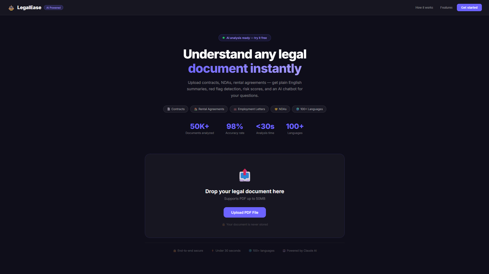
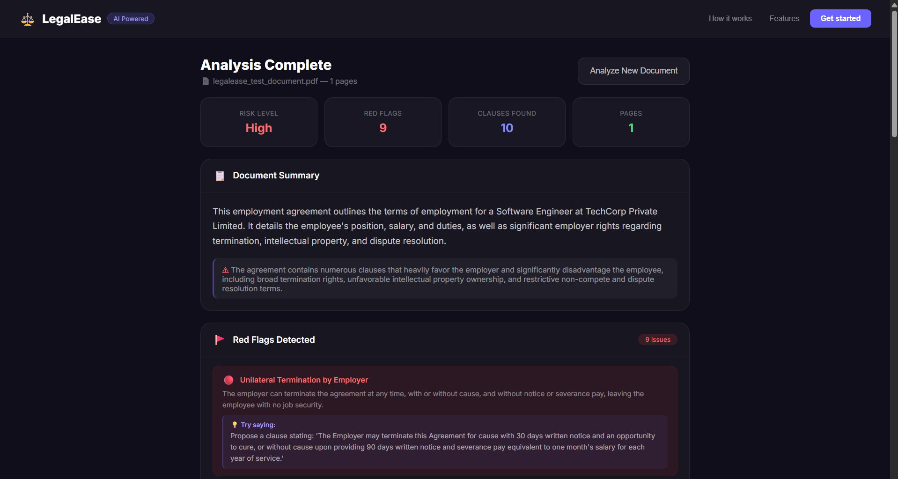
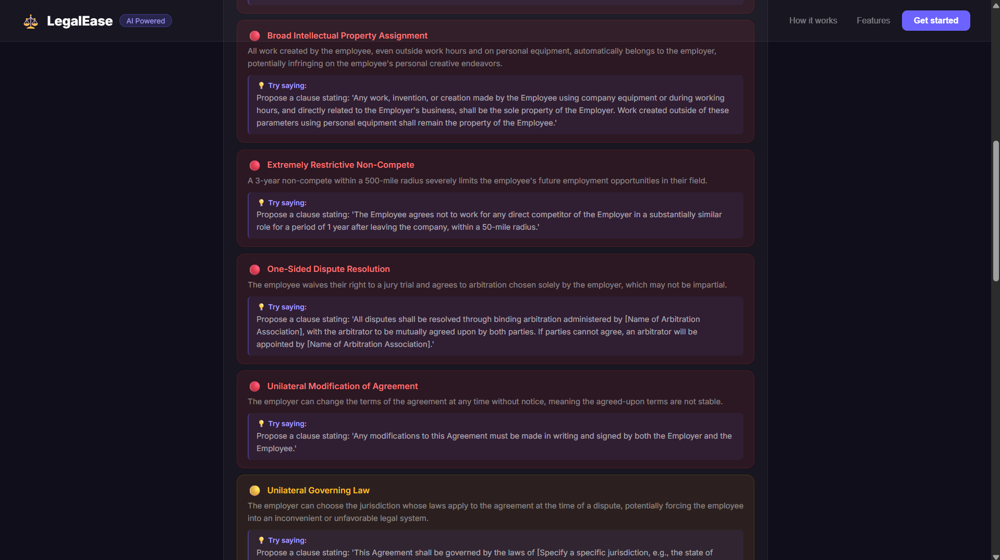
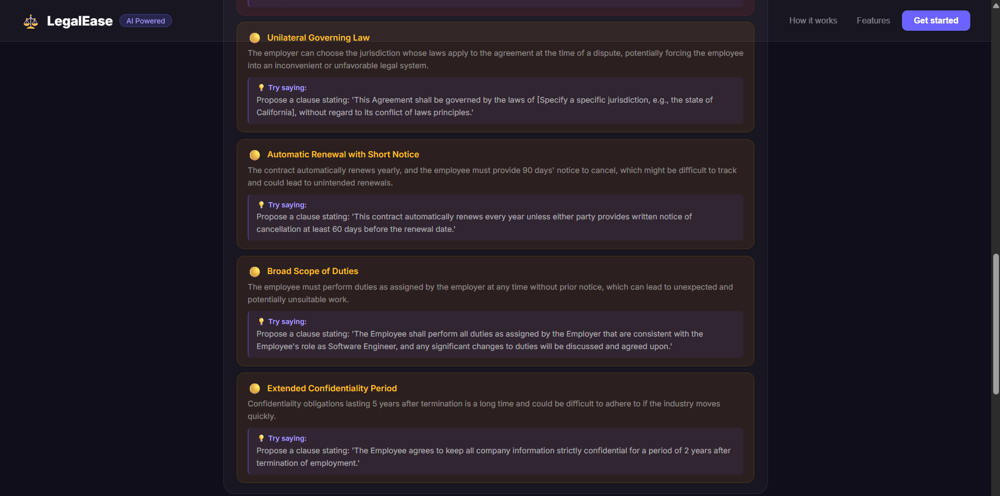
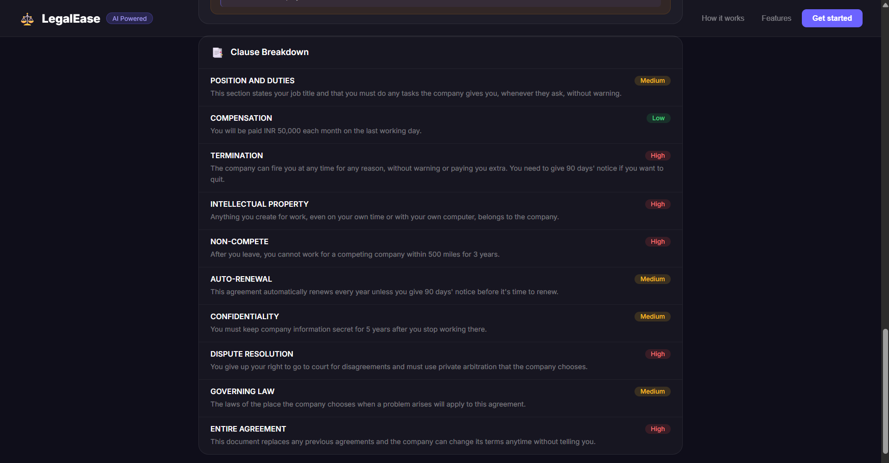
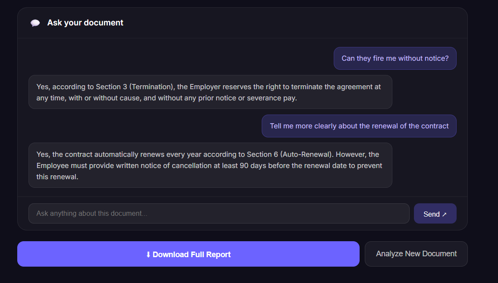
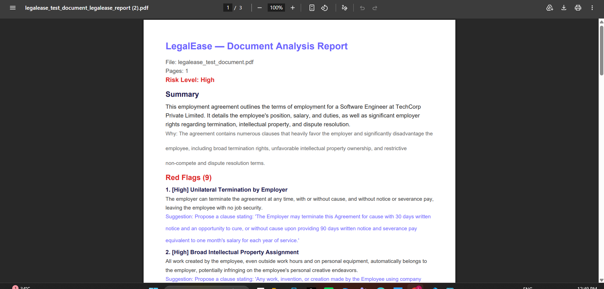
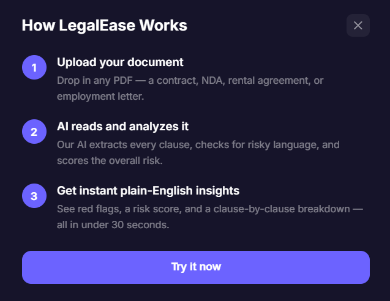
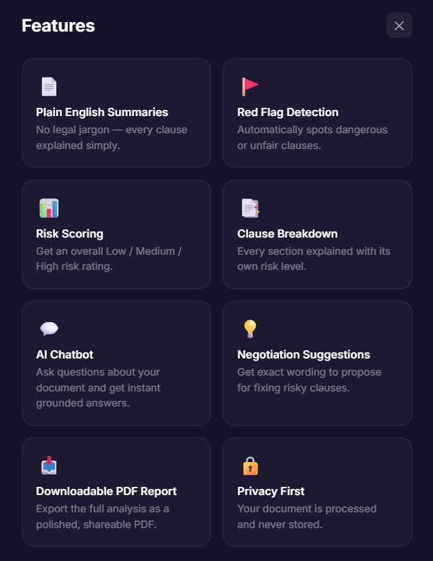

# ⚖️ LegalEase

**AI-powered legal document analyzer** — upload any contract, NDA, rental agreement, or employment letter and instantly get a plain-English summary, red flag detection, a risk score, negotiation suggestions, and an AI chatbot to ask questions about your document.

🔗 Live Demo: https://legal-ease-lilac.vercel.app/

---

## 📸 Preview

### Uploadpage


### Analysis Results





### AI Chatbot


### Download Result as pdf 


### How It Works


### Features


---

## ✨ Features

- **📄 Plain English Summaries** — every document explained in simple, jargon-free language
- **🚩 Red Flag Detection** — automatically identifies risky or unfair clauses with clear explanations
- **📊 Risk Scoring** — get an overall Low / Medium / High risk rating for any document
- **📑 Clause-by-Clause Breakdown** — every section explained individually with its own risk level
- **💡 Negotiation Suggestions** — practical, specific wording you can propose to fix risky clauses
- **💬 AI Chatbot** — ask natural-language questions about your document and get answers grounded in the actual text
- **📥 Downloadable PDF Report** — export the full analysis as a polished, shareable PDF
- **🌍 Multilingual Support** — works on documents in 100+ languages
- **🔒 Privacy First** — documents are processed in memory and never stored

---

## 🛠️ Tech Stack

**Frontend**
- React.js
- Custom CSS (dark, glassmorphism-inspired UI)
- jsPDF (PDF report generation)

**Backend**
- Python + FastAPI
- PyMuPDF (`fitz`) — PDF text extraction
- Google Gemini API (`google-genai` SDK) — document analysis & chatbot

---

## ⚙️ How It Works

1. **Upload** — drag and drop any legal PDF document
2. **Extract** — the backend extracts all text from the PDF using PyMuPDF
3. **Analyze** — the extracted text is sent to Google Gemini, which returns a structured analysis: summary, risk level, red flags (with negotiation suggestions), and a clause-by-clause breakdown
4. **Chat** — ask follow-up questions about the document; the chatbot answers using only the document's actual content as context
5. **Export** — download the complete analysis as a formatted PDF report

---

## 🚀 Running Locally

### Prerequisites
- Node.js
- Python 3.10+
- A free [Google Gemini API key](https://aistudio.google.com/app/apikey)

### Backend Setup

```bash
cd backend
python -m venv venv
venv\Scripts\activate        # Windows
# source venv/bin/activate   # Mac/Linux

pip install -r requirements.txt
```

Create a `.env` file inside `backend/`:

```
GEMINI_API_KEY=your_gemini_api_key_here
```

Run the backend:

```bash
uvicorn main:app --reload
```

The API will be available at `http://localhost:8000`.

### Frontend Setup

```bash
cd frontend
npm install
npm start
```

The app will open at `http://localhost:3000`.

---

## 📂 Project Structure

```
LegalEase/
├── backend/
│   ├── main.py          # FastAPI app — upload, analysis, chat endpoints
│   ├── requirements.txt
│   └── .env              # API key (not committed)
└── frontend/
    ├── src/
    │   ├── App.js         # Main React component
    │   └── App.css        # Styling
    └── package.json
```

---

## 🎯 Why I Built This

People sign contracts, rental agreements, and employment letters every day without fully understanding what they're agreeing to. LegalEase makes legal documents accessible to everyone — no law degree required. It was built to explore practical applications of LLMs in solving everyday problems, combining full-stack development with AI integration, prompt engineering, and thoughtful UX design.

---

## 📬 Contact

**Lakshetha Ravikumar**
B.Tech Computer Science Engineering, VIT Chennai

Feel free to reach out or connect if you have feedback or questions about this project!
